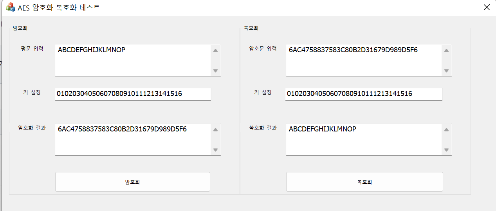

# AES 암호화/복호화 테스트

* AES 128bit ECB 모드
* 평문은 길이 자유롭게 입력 가능함.
* 디폴트 평문으로 "ABCDEFGHIJKLMNOP",키값 :"01020304050607080910111213141516 임의로 설정함.
* 키값을 그림처럼  Hex값형태로 16자리를 넣어야함.
* 복호화시에는  키값과 암호화된 값을 동시에 입력하여함
 
